
# CG-final
ARCore&amp;OpenGL Demo

本次大作业的成果是一个android平台App，结合了ARCore和Opengl技术，实现了在现实场景中加载机器人模型，通过手机与机器人进行简单交互；

整个App架构如下：

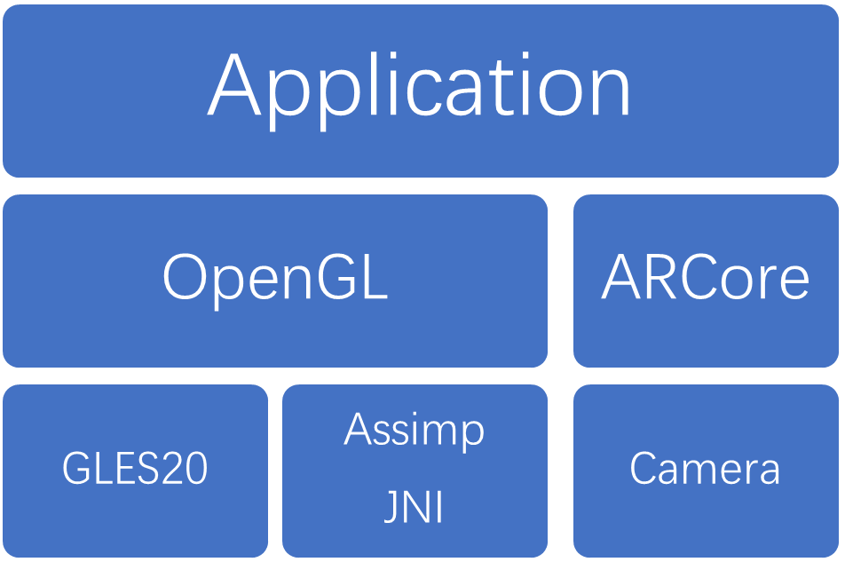

-   Application层作为应用最上层，提供与用户进行交互的功能，也负责绘制ARCore和OpenGl层结果。

-   OpenGL层负责渲染管道，渲染管道功能（shader，光照等部分）由Android中的GLES20库提供，模型读取采用C++的模型加载库Assimp，通过JNI，NDK调用；

-   ARCore层通过Camera提供运动跟踪，环境感知，光线评估等功能；

>   接下来自顶向下介绍各层的内容：

>   第一个是Application层，作为顶层，它依赖下面各层提供的各种功能，但也对底下各层起到了组织管理各层功能的作用；

>   App启动后，android先会检查各手机上有没有必需的framework；之后在onDrawFrame（）中逐帧绘制，下面是逐帧绘制的流程：

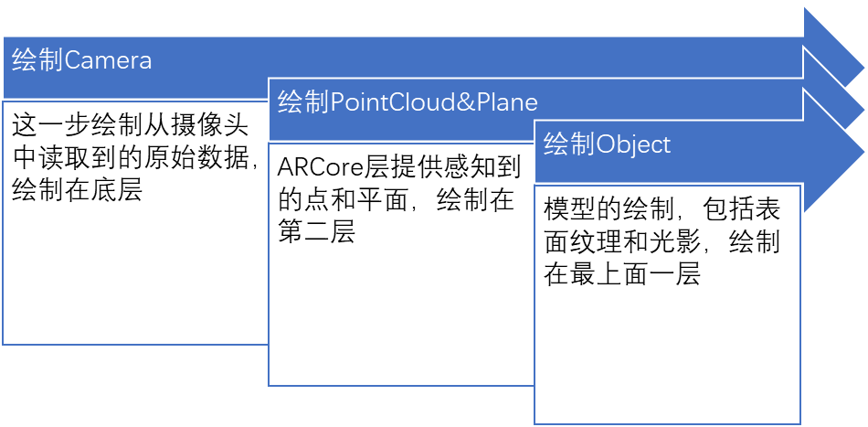

>   绘制后结果如下图，可以看到camera原始画面，pointcloud（蓝色点），plane（白色三角网格）和模型都能显示出来，他们之间的层级关系就是先绘制的在底层，后绘制的在顶层；

>   除了绘制，Application层还提供了基本的交互。在这个App中，我们可以利用方向轮来控制模型的移动，其本质就是一个动画的控制器，控制模型动画的播放停止和当前帧的姿态；

>   接下来是OpenGL层。其实上一层的绘制功能提供者都是OpenGL，例如Camera原始数据的绘制就是生成一个Bitmap，把它作为纹理按照像素绘制到屏幕上，其实也还是渲染管道那一套；

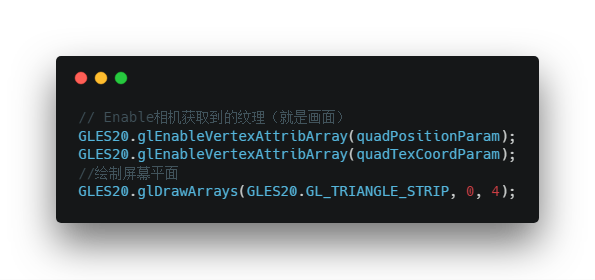

>   为了显示体验更好，三个绘制过程都分别开了线程，也分别有对应的Shader和program；但只有绘制模型的过程有光源和阴影绘制，下面是模型绘制过程中的fragment
>   shader：

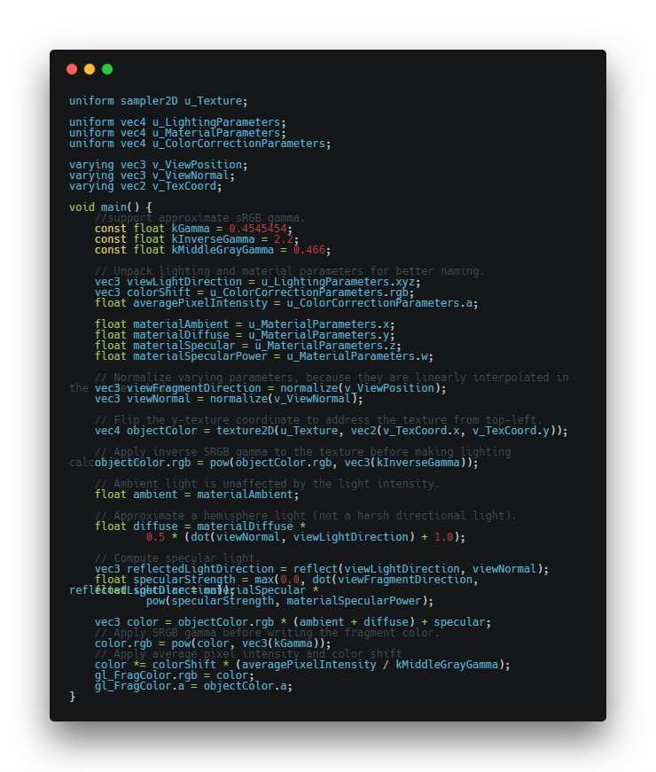

>   在PointCloud和Plane层的绘制中，基本原理都是利用OpenGL把需要的元素绘制到屏幕上，也都是得经过顶点着色器，片元着色器等渲染管道；

>   三层渲染后的效果如下：

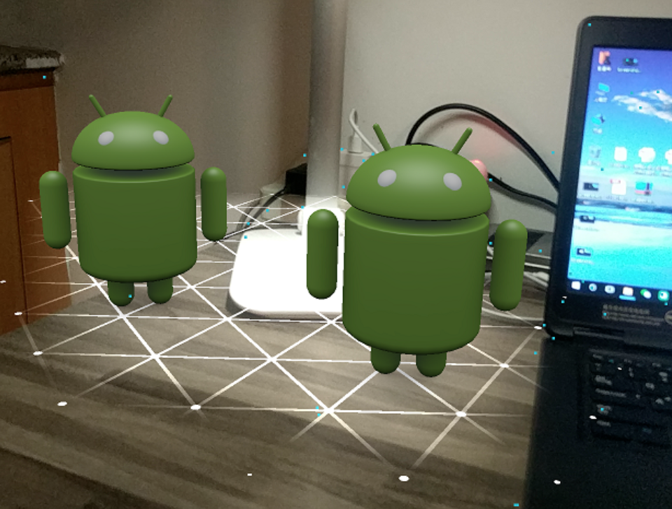

>   可以看到蓝色的pointcloud，白色的plane和模型，当然还有最底层摄像头捕获数据的展示；

>   对于ARCore层，这次大作业采用的是ARCore1.6版本，所以具备了基础的光线评估能力。对于整个App而言，ARCore层提供三个主要功能：运动跟踪、环境理解和光线评估；

>   **运动跟踪**。ARCore
>   可以在手机移动的过程中知道，相对于真实世界手机所在的位置和方向（姿势）。当手机在真实世界移动时，ARCore使用称为并发测距和映射的过程来了解手机与周围世界的相对位置。ARCore能检测到Camera捕获的图像在视觉上的不同特征，称为特征点。它使用这些点计算其位置变化。随着时间的推移，通过视觉信息与来自IMU设备的惯性测量，ARCore就可以估算出Camera相对于真实世界的姿态（位置和方向）。所以在我们的App中无需计算相机的位置姿态等信息，这些全部交给了ARCore接管，我们只需要移动手机，就能实时看到模型的变化；

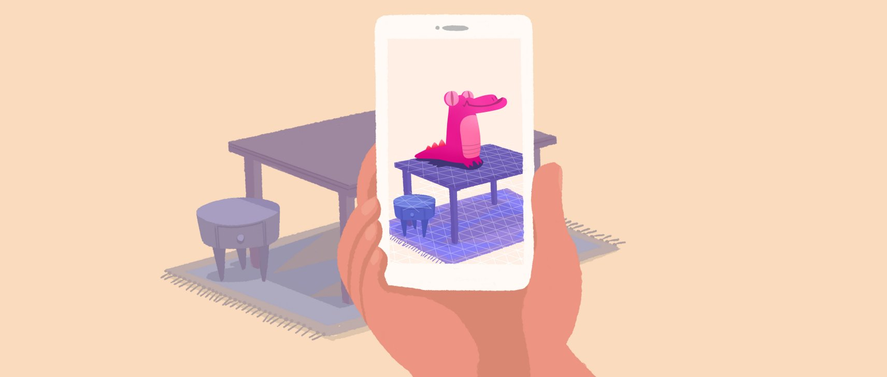

>   **环境理解**。ARCore可以让手机检测出一块水平面的位置和大小。如地面、桌子、书架等等。这样就可以将虚拟物体放置到检测出的水平面上了。ARCore会查找常见水平表面（如桌面）上的特征点集群，除此之外，ARCore还可以确定每个平面的边界，并将以上信息提供给App。
>   这样，我们就可以使用这些信息，并将虚拟模型放置在平坦的表面上了。在App中，我们把这些信息可视化，检测到的点用蓝色点表示，平面用白色三角网格表示，得益于这些信息，我们在控制模型移动的时候，当ARCore检测到前方有落差或者有墙壁的时候，我们无法移动模型，这个就是初步的环境感知。但这个也带来一个弊端，就是由于ARCore是利用特征点来检测平面，因此可能无法正确检测到没有纹理的平坦表面（如纯色桌面）。

>   **光线评估**。ARCore
>   可以让手机估算出当前环境的光线强度，这样可以让虚拟物理显示在真实环境中更加逼真。但这也是很初步的环境光评估，只能影响模型表面纹理的相对明暗（提供一个0\~1.0的值，0代表最暗，1代表最亮），至于根据环境光推算光源位置和方向目前是无法实现的，所以在这个App中我使用的是固定位置点光源来渲染阴影；

>   基于上面三个能力，在我们触摸屏幕的时候，ARCore首先会检查我们是否点在了平面上，如果是，就放置一个锚点，这个锚点可以被ARCore跟踪，并把模型绑定在锚点上；具体代码如下：

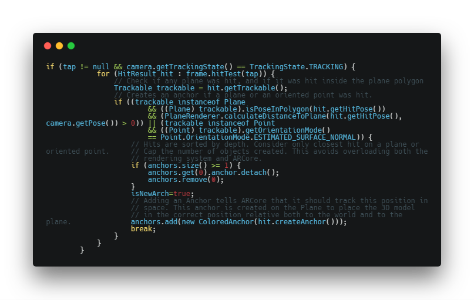

>   在最低一层中，GLES20和C中的GLES基本没有区别，Camera是Android提供的底层接口，所以这一层中主要是Assimp(JNI)模块；

>   Assimp是一个c++下的模型加载库，所以用在移动平台，首先就是要编译平台对应的库；由于测试机是三星S7，所以对应的平台是arm64-v8a，所以在gradle中对Cmake编译作如下配置（x86是因为要在windows模拟器上测试）：

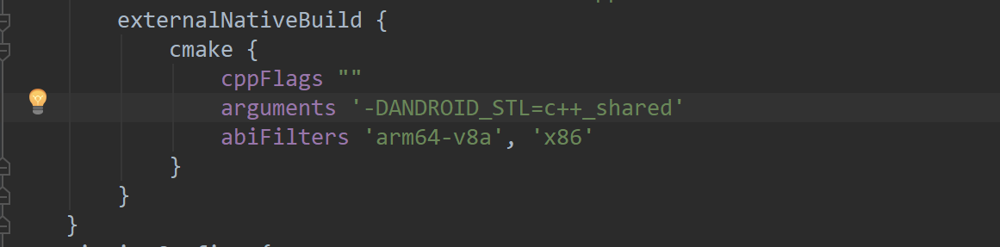

>   编译出动态库后需要使用的话，还需要调用NDK（提供android平台下C的支持），暴露出来接口如下：

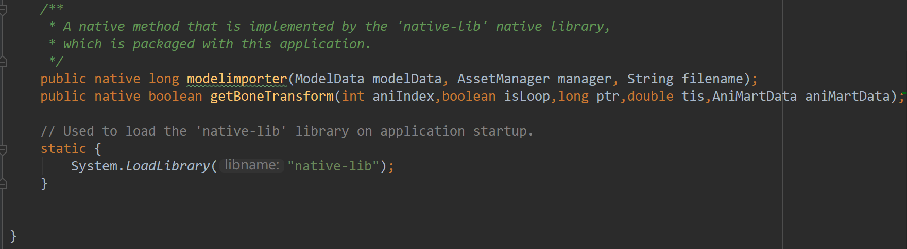

>   可以看到Assimp提供了两个功能，一个是加载模型，从AssetManager中读取模型文件，加载后放到ModelData这个数据类中；另一个功能是读取动画，getBoneTransform（）就是读取当前时刻的骨骼动画数据，aniIndex指的是需要加载动画的类型（一个模型有多个动画），isLoop表示是否循环播放，ptr指的是上面读取的模型文件在内存中的索引（即为指针），tis就是需要第几帧的数据，最后把数据都放在AniMartData这个数据类中；

>   模型数据读取核心代码如下：

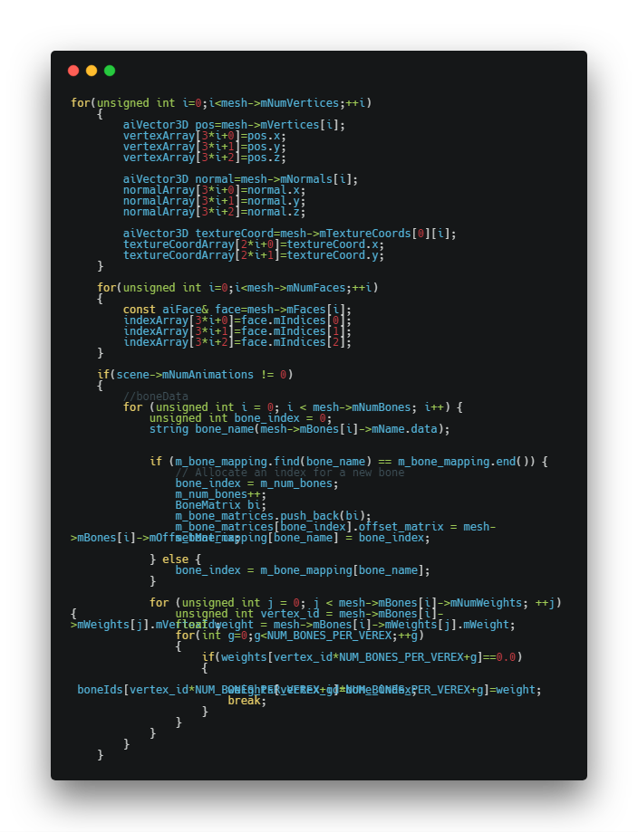

>   读取后利用java到的反射调用数据对象的方法，把数据写入：

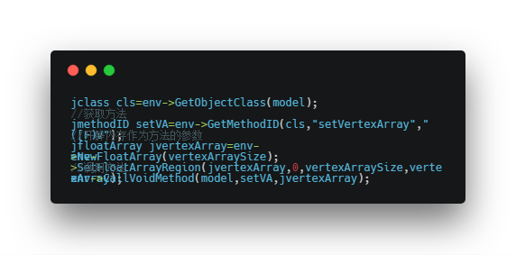

>   最终实现效果：

-   模型加载；

-   环境感知，光线估计；

-   移动动画，包括一个攻击动画；

>   测试机运行结果：

>   实验代码仓库：<https://github.com/noterpopo/CG-final>
